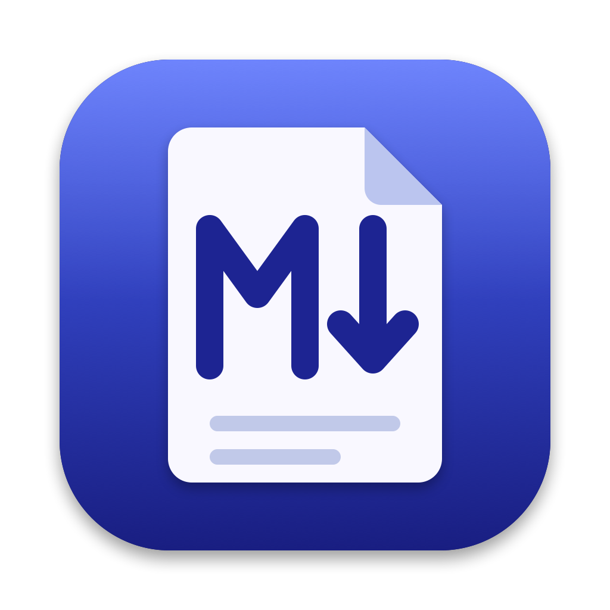

# Markdown Reader

A small, fast, read-only Markdown reader for macOS. Open a file or a folder and read: no editor, no server, no WebKit in the reading process.

A short-lived Go helper parses the document and streams a styled representation; a native AppKit/TextKit 2 app presents it. The reader keeps one document in memory and nothing else, so it stays light and opens large files quickly.



## Build and run

Requires macOS 13+, Go 1.25+ and the Xcode Command Line Tools. Node and npm are needed only to build the Mermaid plugin.

```sh
./scripts/build-viewer-only.sh
open "dist/Markdown Reader.app"
open -a "$PWD/dist/Markdown Reader.app" examples/Welcome.md
```

The app is ad-hoc signed for the current Mac. It is not notarized for distribution. To make it the default, select a `.md` file in Finder, then **Get Info → Open with → Markdown Reader → Change All…**.

## Using it

- **Open** a file or a folder with **⌘O**, by dropping it on the window, from Finder, or on the command line.
- **Folder rail.** Opening a folder (or a file with no folder open) shows a sidebar of its subfolders and Markdown files, loaded as you expand them. Selecting a file opens it; opening a document any other way selects its row. Hide it with **⌃⌘S**; **File → Close Folder** removes it.
- **Reload** with **⌘R**. Reloading keeps your place. The reader also remembers its place in each document you switch away from during the session.
- **Find** with **⌘F**, **⌘G** and **⇧⌘G**. The window subtitle shows the match count, for example `“actors” · 3 of 18`.
- **⌘-hover / ⌘-click** a document name (`spec/07-care-model-boundary.md`) to underline it and open it. Names are looked up from the current folder, each parent folder and the open folder.
- **Switching documents** while one is still loading cancels the first load.

## What it renders

- CommonMark with tables, strikethrough, task lists, block quotes, nested lists and rules. Raw HTML is not rendered.
- **Front matter** appears as a properties table of key and value. Anything it cannot structure is shown as a code block instead.
- **Code** is syntax highlighted in GitHub colours for Go, JavaScript/TypeScript, JSON, shell, SQL, Python, YAML and diff. Inline code is a rounded pill.
- **Tables** are drawn as a real grid whose text can be found, selected and copied. A table wider than the reading column opens expanded to the window width, with a **Fit to window / Expand** button above it to switch back.
- **Mermaid diagrams** (fenced `mermaid` blocks) are rendered by an optional plugin. The text shows first with a placeholder per diagram, and the diagrams fill in as they finish. **File → Export Diagram as SVG…** saves one. **Plugins → Enable Plugins** turns the plugin off.
- Links open in the default browser, and relative links open in the app.

See [viewer-only/plugins/README.md](viewer-only/plugins/README.md) for the plugin protocol, limits and Mermaid safety settings.

## Limits and known gaps

- Files must be regular UTF-8 text of at most 16 MiB. The reader never writes to a document.
- Selecting inside a table follows line order, so dragging across a table highlights whole rows. A phrase that wraps across lines in a table cell cannot be found.
- Heading anchors (`#section` links) are not supported.
- A document holds at most 16 diagrams. A plugin is trusted application code, not a sandbox, and there is no plugin installer.
- The rail does not refresh when files change on disk. Reopen the folder to refresh it.

## Development

```sh
go test ./...
go vet ./...
./scripts/build-viewer-only.sh
python3 scripts/test-reader-plugins.py   # needs the built bundle and WebKit services
```

- `cmd/markdown-reader` is the parser helper: Markdown in, the `MVRO1` presentation stream out. It owns tables, front matter, highlighting and plugin dispatch.
- `viewer-only/main.m` is the AppKit/TextKit 2 app. `viewer-only/plugins` holds the plugin protocol and the Mermaid plugin.
- `assets/icons` holds the app icon, regenerated with `scripts/make-icons.sh`.
- Go tests drive the helper's real output stream and plugin processes. They do not prove native behaviour, which is checked by running the bundled app.
- Memory measurements and method are in [viewer-only/README.md](viewer-only/README.md) and [viewer-only/results](viewer-only/results).

The repository also still contains the earlier editor build, `Markdown Reader Editor.app` (`cmd/markdown-reader-editor`, `internal/`, `./scripts/build.sh`) and the comparison prototypes ([comparison](comparison/README.md), [rust-comparison](rust-comparison/README.md)). They are kept for reference and are not the current product. [VERIFICATION.md](VERIFICATION.md) records that earlier work.

The parser uses [Goldmark](https://github.com/yuin/goldmark). Dependencies are pinned in `go.mod` and `go.sum`.
