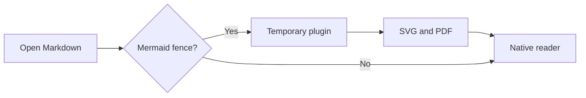
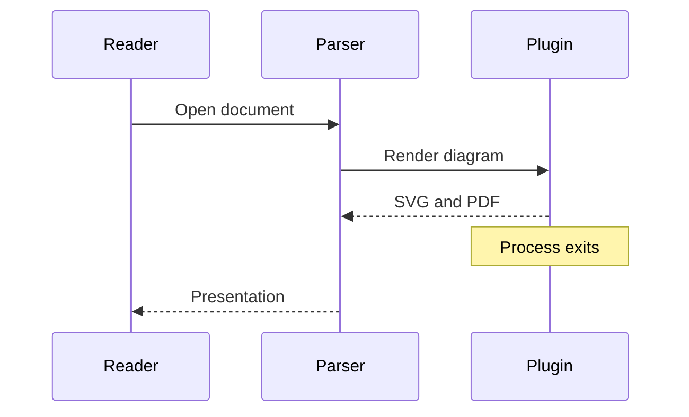

# Mermaid plugin

This diagram is rendered by the optional Mermaid plugin. The reader displays a
vector PDF and retains the original SVG for export.



## Sequence diagram



## Ordinary code remains code

```go
fmt.Println("No plugin is launched for this block")
```
